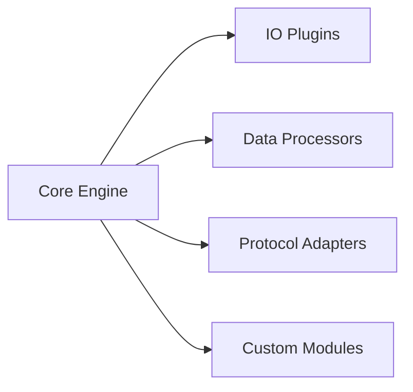

# AetherScript CLI System Overview

## Introduction
The AetherScript Command Line Interface (CLI) serves as the primary interaction layer for designing, executing, and monitoring automation pipelines. Built on an extensible TypeScript architecture, the system combines lightweight execution with enterprise-grade capabilities through its modular plugin system and real-time visualization engine.

## Core Architectural Components

### 1. CLI Engine
- **Execution Core**: Microkernel architecture managing pipeline lifecycle
- **Command Router**: Hierarchical command structure with automatic help generation
- **Cross-Platform Runtime**: Universal Node.js runtime with system compatibility layer

### 2. Plugin System
- **Zero-Config Discovery**: Automatic detection of plugins in `./aether/plugins` directory
- **Standardized Interface**: Common API contract for plugin interoperability
- **Semantic Version Resolution**: Intelligent dependency management with conflict prevention

### 3. Pipeline Runtime
- **DAG Execution Engine**: Directed Acyclic Graph processor with parallel task execution
- **State Management**: Immutable pipeline context with versioned snapshots
- **Error Handling**: Fault isolation with configurable retry policies and circuit breakers

## Extensibility Model

### Plugin Architecture


1. **Automatic Registration**
    - Manifest-driven plugin discovery (`plugin.yml`)
    - Runtime module hot-loading
    - Schema validation during initialization

2. **Extension Points**
    - Hook system for pipeline lifecycle events
    - Custom command injection
    - Template override capabilities

## Pipeline Execution Model

### Workflow Definition
```yaml
pipeline:
  name: data-processing
  steps:
    - extract: csv-loader@v1
    - transform: python-cleaner@v2
    - load: db-writer@v3
```

1. **Compilation Phase**
    - Syntax validation and AST generation
    - Plugin dependency resolution
    - Execution plan optimization

2. **Runtime Phase**
    - Isolated context per pipeline instance
    - Stream-based inter-step communication
    - Real-time progress tracking

## Visualization System

### Real-Time Monitoring
- **WebSocket Interface**: Bidirectional communication channel
- **Interactive Topology**: Renderable pipeline DAG with execution metrics
- **Cross-Platform Viewer**: Browser-based visualization with CLI TUI fallback

### Diagnostic Features
- Execution timeline with performance heatmaps
- Live log streaming with structured filtering
- Resource utilization dashboards

## Scalability Considerations

1. **Vertical Scaling**
    - Concurrent pipeline execution with resource quotas
    - Memory isolation through worker threads
    - Configurable garbage collection strategies

2. **Horizontal Scaling** (Enterprise Edition)
    - Distributed task orchestration
    - Cluster-aware load balancing
    - Persistent work queues with Redis backend

## Security Architecture

- **RBAC Integration**: Role-based command authorization
- **Pipeline Sandboxing**: Restricted filesystem access
- **Audit Trail**: Tamper-evident execution logs
- **Secrets Management**: Vault integration with automatic credential rotation

---

This architectural foundation enables AetherScript to support complex automation workflows while maintaining the simplicity and developer experience of a lightweight CLI tool. The system's event-driven design and modular architecture ensure adaptability to diverse operational environments without compromising performance.