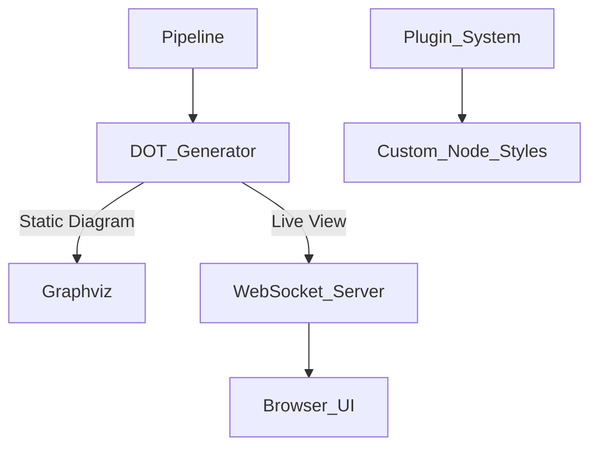

# Pipeline Visualization in AetherScript CLI

## Diagram Generation Architecture
AetherScript CLI provides built-in workflow visualization using Engineered Graph Representations (EGR). This subsystem converts pipeline definitions into interactive diagrams through three core components:

### 1. Pipeline Analysis Engine
- Parses `.aether` configuration files
- Identifies task dependencies through static analysis
- Extracts plugin metadata for visual annotations

### 2. DOT File Generator
- Creates industry-standard Graphviz DOT files
- Maintains consistent node styling:
  - **Rounded rectangles:** Core tasks
  - **Diamonds:** Conditional operations
  - **Ovals:** Input/Output boundaries
- Color-coded edges based on dependency types

### 3. Visualization Backends


## Key Visualization Features
1. **Real-Time Monitoring**
   - Watch mode updates diagrams in <200ms
   - Visual indicators for execution status:
     - █ Processing (blue)
     - ✓ Completed (green)
     - ⚠ Warning (yellow)
     - ✗ Failed (red)

2. **Automation-Ready Output**
   ```bash
   aether diagrams generate --format=svg --optimize
   ```
   Supports multiple formats:
   - SVG (default)
   - PNG (300dpi)
   - PDF (vector)
   - Mermaid (for documentation)

3. **Plugin Integration**
   - Zero-config extension detection
   - Visual differentiation of third-party nodes
   - Automatic documentation tooltips

## Usage Scenarios

### Static Diagram Generation
```bash
aether diagram:pipeline build main.aether \
  --output workflow.svg \
  --legend \
  --hide-parameters
```

### Interactive Live View
```bash
aether diagram:watch deploy.aether --port 3000
```
Opens browser at `http://localhost:3000` with:
- Live execution progress
- Zoom/pan controls
- Node inspection panel
- Execution time overlays

### CI/CD Integration
```bash
aether diagram:pipeline ci-config.aether \
  --format=png \
  --minimal \
  --output=./artifacts/pipeline.png
```

## Security Considerations
- Diagrams never transmit pipeline data externally
- Runtime visualization requires explicit `--watch` flag
- File outputs sanitize sensitive parameter values by default
- Disable metadata with `--no-metadata` for public sharing

This visualization system enables rapid pipeline comprehension while maintaining strict separation from execution logic. All diagram components adapt dynamically to plugin additions without requiring manual diagram updates.