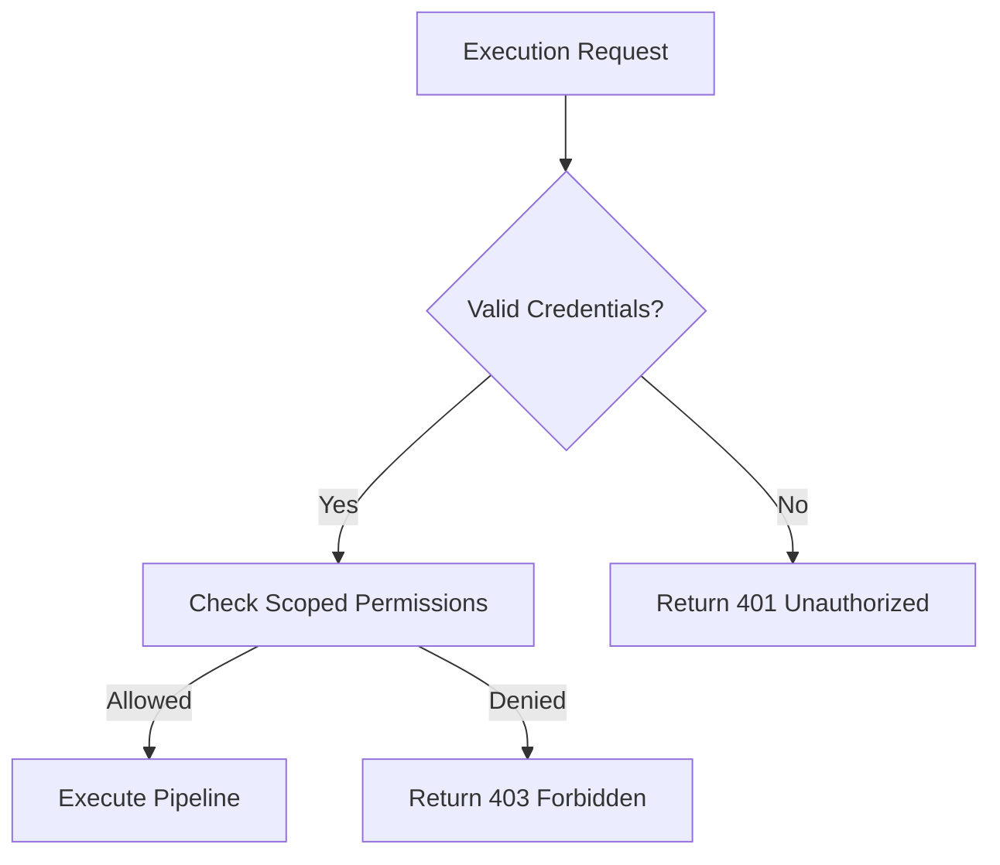

# Execution Authorization in AetherScript

## Overview  
AetherScript employs a robust execution authorization framework to govern pipeline operations. This system ensures granular control over:  
- **Who** can execute pipelines  
- **Which resources** pipelines may access  
- **What operations** are permitted during execution  

Authorization integrates with all execution modes (`local`, `hybrid`, `remote`) through a unified policy engine.

---

## Key Concepts

### 1. Service Accounts
Execution privileges are granted to **service accounts** rather than individual users. Each account contains:

```yaml
# Example service account configuration
apiVersion: aether/v1
kind: ServiceAccount
metadata:
  name: ci-bot-account
spec:
  apiKey: $AES_ENCRYPTED_KEY
  scopes:
    - pipelines:execute
    - artifacts:read
  expiration: 2025-01-01T00:00:00Z
```

### 2. Permission Scopes
| Scope                  | Capabilities                                  |
|------------------------|-----------------------------------------------|
| `pipelines:execute`    | Initiate new pipeline executions              |
| `pipelines:stop`       | Terminate running pipelines                   |
| `artifacts:read`       | Access published artifacts                    |
| `artifacts:write`      | Publish new artifacts                         |
| `logs:read`            | View execution logs                           |
| `admin:credentials`    | Manage service account keys (elevated privilege) |

### 3. Execution Contexts
Authorization checks vary based on execution context:

| Context                | Authentication Method                     |
|------------------------|-------------------------------------------|
| CLI Execution          | Local machine credentials + API key       |
| Automated Runs         | Service account token with limited scopes | 
| Remote Triggers        | OAuth 2.0 Client Credentials flow         |

---

## Authorization Workflow



1. **Credential Validation**: Verify API key/token signature
2. **Scope Evaluation**: Confirm requested operations match granted permissions
3. **Resource Binding**: Validate pipeline accesses only permitted resources
4. **Audit Logging**: Record authorization decision with request metadata

---

## Implementing Authorization

### Pipeline-Level Permissions
Restrict pipeline execution to specific service accounts:

```yaml
# pipeline.yml
auth:
  allowedAccounts:
    - team-alpha-ci
    - release-manager
  maxDuration: 1h # Runtime limit
```

### Runtime Checks
Embed authorization assertions within steps:

```js
// Custom validation step
await auth.validate({
  required: ['artifacts:write'],
  resource: 's3://prod-bucket'
});
```

### System-to-System Auth
For OAuth 2.0 integrations:

```bash
aether auth token --grant-type client_credentials \
  --client-id $CLIENT_ID \
  --client-secret $CLIENT_SECRET \
  --scope 'pipelines:execute'
```

---

## Security Best Practices

1. **Principle of Least Privilege**:  
   Grant only essential scopes per service account

2. **Short-Lived Credentials**:  
   Configure token expiration ≤24h for production accounts

3. **Secret Management**:  
   Always store keys in encrypted vaults (AWS Secrets Manager, HashiCorp Vault)

4. **Audit Trails**:  
   Review execution logs monthly:
   ```bash
   aether audit --action execute --last 30d
   ```

5. **AuthZ Middleware**:  
   Implement custom validation plugins for business-specific rules:
   ```python
   # auth_plugin.py
   def pre_execute_hook(context):
       if not context.user_has_role('approver'):
           raise AuthException('Missing approval')
   ```

---

## Troubleshooting

| Symptom                     | Resolution Steps                                  |
|-----------------------------|---------------------------------------------------|
| 403 Forbidden errors        | 1. Verify account scopes<br>2. Check pipeline auth rules |
| Expired credentials         | Rotate API keys using `aether auth rotate-keys`   |
| Missing resource permissions| Update service account scope bindings             |
| Cross-account denial        | Validate trust relationships between accounts     |

> **Note**: For enterprise environments, use `aether auth enterprise sync` to integrate with corporate identity providers.

For advanced configurations, refer to:  
- [Plugin Architecture](../01-core-concepts/04-plugin-system.md)  
- [Security Model](../05-advanced/02-security-model.md)